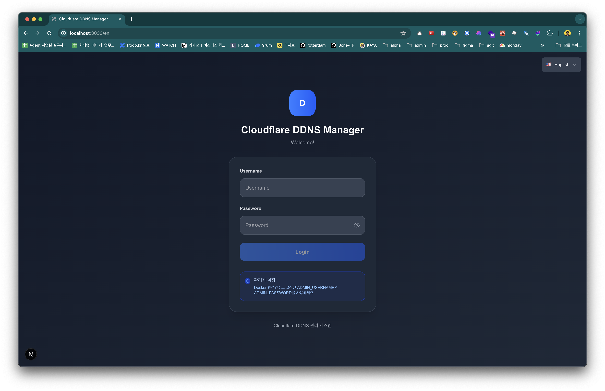
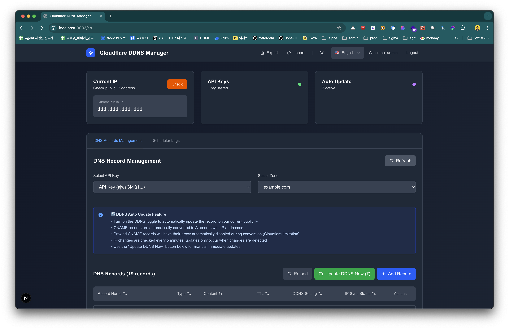
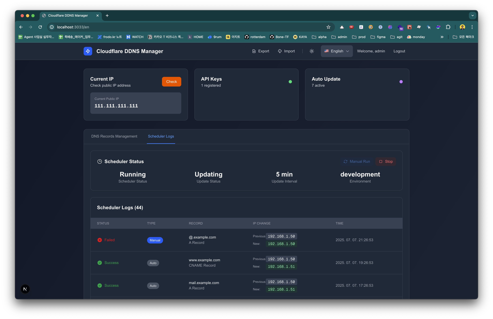

# Cloudflare DDNS Manager

🏠 **自宅サーバーを運用されていますか？動的IPアドレスの変更でお困りではありませんか？**

このプロジェクトは、NoIPやDynDNSのような有料DDNSサービスを代替する無料ソリューションです。
Cloudflareを使用して、動的IP環境でも独自ドメインで安定したホームサーバーアクセスを実現します。NAS、ゲームサーバー、開発環境など、あらゆるセルフホストサービスに最適です。

[](https://hub.docker.com/r/gmkseta/ddns-ui)
[](https://github.com/gmkseta/ddns-ui/releases)
[](LICENSE)

**🌍 言語**: [English](README.md) | [한국어](README.ko.md) | [日本語](README.ja.md)


## 🤔 DDNSとは？なぜ必要なのでしょうか？

**問題点：** 日本の多くの家庭用インターネット接続（NTT、SoftBank、auなど）は、定期的に変更される動的IPアドレスを使用しています。これにより、固定アドレスでの自宅サーバーへのアクセスが困難になります。

**解決策：** ダイナミックDNS（DDNS）は、IPアドレスが変更されるたびにドメインのDNSレコードを自動更新し、`home.yourdomain.com`が常に現在のIPアドレスを指すようにします。

**一般的な使用例：**
- 🏠 **ホームサーバーアクセス**: NAS、Plexサーバー、ホームオートメーションへのリモートアクセス
- 🎮 **ゲームサーバー**: Minecraft、Valheimなどのゲームサーバーを友人と共有
- 💻 **開発環境**: どこからでも開発環境にアクセス
- 📹 **セキュリティカメラ**: 高額なクラウドサービスなしで自宅の監視カメラを表示
- 🌐 **セルフホスティング**: 自宅からWebサイト、ブログ、サービスを運営

## 📸 スクリーンショット

### ログイン


### ダッシュボード - DNSレコード


### ダッシュボード - ゾーン選択


### スケジューラーログ


## 💰 なぜ有料DDNSサービスより優れているのでしょうか？

| サービス | コスト | 独自ドメイン | 制限事項 |
|---------|------|-------------|-------------|
| **NoIP** | 無料（30日更新） / 年$25 | ❌ 提供ドメインのみ | 手動更新が必要 |
| **DynDNS** | 年$55（約7,000円） | ❌ 限定されたドメイン | 基本ニーズには高額 |
| **Duck DNS** | 無料 | ❌ サブドメインのみ | カスタムドメイン不可 |
| **このプロジェクト** | **永久無料** | ✅ **あなたのドメインを使用** | **制限なし** |

**その他の利点：**
- 🌍 CloudflareのグローバルCDNネットワークを活用
- 🔒 CloudflareのDDoS保護機能を内蔵
- ⚡ 従来のDDNSより高速なDNS解決
- 🎯 DNSレコードの完全な制御
- 📊 すべてを管理できる美しいWeb UI

## ✨ 機能

- **🌍 多言語サポート**: 韓国語（한국어）、英語、日本語
- **🔄 動的IP監視**: パブリックIPアドレスを自動的に検出して更新
- **☁️ Cloudflare統合**: Cloudflare DNS APIとの直接統合
- **🎨 モダンなWebインターフェース**: ダーク/ライトテーマ対応のクリーンでレスポンシブなWeb UI
- **📱 モバイルフレンドリー**: モバイルデバイスとタブレット向けに最適化
- **🏗️ マルチゾーンサポート**: 複数のCloudflareゾーンでDNSレコードを管理
- **⏰ 自動更新**: 設定可能な間隔で自動IP確認とDNS更新
- **🎛️ 手動制御**: 即座の手動IP更新とスケジューラー制御
- **📊 更新ログ**: すべてのIP変更を詳細なログで追跡
- **💾 エクスポート/インポート**: DNS設定のバックアップと復元
- **🔒 セキュア**: 設定可能な資格情報によるJWTベース認証

## 🚀 クイックスタート

### 前提条件
- ドメイン名（どこで購入したものでも可）
- CloudflareでのDNS管理（無料）
- Cloudflare APIトークン
- Dockerのインストール

> ⚠️ **セキュリティ注意**: デフォルトの認証情報は初期設定用のみです。本番環境では必ず変更してください！

### 🎯 最速スタート（コピー＆ペースト）

```bash
# Docker Composeで1行セットアップ
curl -O https://raw.githubusercontent.com/gmkseta/ddns-ui/main/docker-compose.yml && \
echo -e "ADMIN_PASSWORD=$(openssl rand -base64 12)\nJWT_SECRET=$(openssl rand -base64 32)" > .env && \
docker-compose up -d && \
echo "✅ DDNS UIが http://localhost:3000 で実行中です" && \
echo "👤 ユーザー名: admin" && \
echo "🔑 パスワード: $(grep ADMIN_PASSWORD .env | cut -d'=' -f2)"
```

### 🐳 Docker使用（推奨）

```bash
# デフォルト設定でクイックスタート（後でパスワードを変更！）
docker run -d \
  --name ddns-ui \
  -p 3000:3000 \
  -v ddns-data:/app/data \
  -e ADMIN_PASSWORD=your-secure-password \
  -e JWT_SECRET=$(openssl rand -base64 32) \
  --restart unless-stopped \
  gmkseta/ddns-ui:latest
```

### 🐳 Docker Compose使用（最も簡単）

**3ステップでクイックスタート:**

```bash
# 1. docker-compose.ymlをダウンロード
curl -O https://raw.githubusercontent.com/gmkseta/ddns-ui/main/docker-compose.yml

# 2. セキュアなパスワードで.envファイルを作成
cat > .env << EOF
ADMIN_PASSWORD=your-secure-password
JWT_SECRET=$(openssl rand -base64 32)
EOF

# 3. サービスを開始
docker-compose up -d
```

**または手動で`docker-compose.yml`を作成:**

```yaml
version: '3.8'
services:
  ddns-ui:
    image: gmkseta/ddns-ui:latest
    container_name: ddns-ui
    ports:
      - "${HOST_PORT:-3000}:3000"
    environment:
      # 管理者認証情報（これらを変更してください！）
      - ADMIN_USERNAME=${ADMIN_USERNAME:-admin}
      - ADMIN_PASSWORD=${ADMIN_PASSWORD:-changeme}
      # JWTシークレットキー（本番環境では必ず変更！）
      - JWT_SECRET=${JWT_SECRET:-your-random-jwt-secret-key}
      # 更新間隔（分）
      - UPDATE_INTERVAL=${UPDATE_INTERVAL:-5}
      - NODE_ENV=production
    volumes:
      - ddns-data:/app/data
    restart: unless-stopped

volumes:
  ddns-data:
```

2. 設定用の`.env`ファイルを作成:
```bash
# サンプルをコピーして編集
cp .env.example .env

# または手動作成
cat > .env << EOF
HOST_PORT=3000
ADMIN_USERNAME=admin
ADMIN_PASSWORD=your-secure-password
JWT_SECRET=$(openssl rand -base64 32)
UPDATE_INTERVAL=5
EOF
```

3. サービスを開始:
```bash
docker-compose up -d
```

**最新バージョンへの更新:**
```bash
# 最新イメージをpullして再起動
docker-compose pull && docker-compose up -d

# または古いバージョンのdocker-composeを使用している場合
docker pull gmkseta/ddns-ui:latest
docker-compose down && docker-compose up -d
```

### 🖥️ ローカル開発セットアップ

```bash
# リポジトリをクローン
git clone https://github.com/gmkseta/ddns-ui.git
cd ddns-ui

# 依存関係をインストール
npm install

# 開発サーバーを起動
npm run dev
```

ブラウザを開いて `http://localhost:3000` にアクセスしてください

## 🔧 設定

### 初期設定

1. `http://localhost:3000` でWebインターフェースにアクセス
2. デフォルトの認証情報でログイン:
   - ユーザー名: `admin`
   - パスワード: `changeme`
3. **⚠️ セキュリティ警告**: 初回ログイン後、すぐにデフォルトパスワードを変更してください！
4. 希望する言語を選択（韓国語/英語/日本語）
5. Cloudflare API認証情報を追加:
   - APIキーセクションに移動
   - Cloudflare APIトークンまたはグローバルAPIキーを追加
   - ゾーンを選択してDNSレコードを設定

### Cloudflare API設定

以下のいずれかが必要です:

**オプション1: APIトークン（推奨）**
- [Cloudflare APIトークン](https://dash.cloudflare.com/profile/api-tokens)に移動
- `Zone:Read`と`DNS:Edit`権限でトークンを作成
- 特定のゾーンにスコープを設定

**オプション2: グローバルAPIキー**
- [Cloudflare APIセクション](https://dash.cloudflare.com/profile/api-tokens)に移動
- グローバルAPIキー + メールアドレスを使用

### DNSレコード設定

1. APIキーとゾーンを選択
2. DDNS更新のために監視するDNSレコードを選択
3. 更新間隔を設定（推奨: 5-30分）
4. ハンズフリー操作のために自動更新を有効化
5. スケジューラーログタブで変更を監視

## 📱 対応言語

- **韓国語（한국어）** - 完全ローカライズ
- **English** - 完全ローカライズ
- **日本語** - 完全ローカライズ

インターフェースはブラウザの言語を自動的に検出して切り替えます。ヘッダーの言語スイッチャーを使用して手動で言語を変更することもできます。

## 🌐 環境変数

| 変数 | 説明 | デフォルト | 必須 |
|------|------|------------|------|
| `ADMIN_USERNAME` | 管理者ログインユーザー名 | `admin` | ⚠️ 変更 |
| `ADMIN_PASSWORD` | 管理者ログインパスワード | `changeme` | ⚠️ 変更 |
| `JWT_SECRET` | JWTトークンシークレットキー | - | ✅ はい |
| `DATABASE_PATH` | SQLiteデータベースファイルパス | `./data/ddns.db` | いいえ |
| `UPDATE_INTERVAL` | 更新間隔（分） | `5` | いいえ |
| `NODE_ENV` | アプリケーション環境 | `development` | いいえ |
| `PORT` | サーバーポート | `3000` | いいえ |

## 📡 APIエンドポイント

アプリケーションは統合用のREST APIを提供します:

- `GET /api/ip` - 現在のパブリックIPを取得
- `GET /api/zones` - Cloudflareゾーンリスト
- `GET /api/records` - DNSレコードリスト
- `POST /api/records/update` - DNSレコードを更新
- `GET /api/logs` - 更新ログを取得
- `POST /api/export` - 設定をエクスポート
- `POST /api/import` - 設定をインポート

## 💾 データ永続性

すべてのデータはコンテナ内の `/app/data/ddns.db` にあるSQLiteデータベースに保存されます。コンテナの再起動後も設定を維持するため、このディレクトリをボリュームとしてマウントしてください。

データベースには以下が含まれます:
- ユーザー認証データ
- Cloudflare APIキーとゾーン
- DNSレコード設定
- 更新ログとスケジューラー履歴
- アプリケーション設定

## 🔒 セキュリティ

- **デフォルトパスワードの変更**: 必ずデフォルトのログイン認証情報を変更してください
- **APIキーセキュリティ**: APIキーは安全に保存され、エクスポート/インポート可能
- **JWT認証**: 設定可能な有効期限付きセッションベース認証
- **ネットワークアクセス**: HTTPSを使用するリバースプロキシの背後での実行を検討
- **定期バックアップ**: エクスポート機能を使用して設定をバックアップ
- **入力検証**: すべての入力は検証およびサニタイズされます

## 🛠️ トラブルシューティング

### よくある問題

1. **Cloudflare APIに接続できない**
   - APIトークン/キーが正しいか確認
   - トークン権限にZone:ReadとDNS:Editが含まれているか確認
   - ゾーンIDが正しいか確認

2. **IP検出が機能しない**
   - アプリはIP検出にipify.org（無料サービス）を使用しています
   - ネットワーク接続を確認
   - ファイアウォールがアウトバウンドリクエストをブロックしていないか確認

3. **コンテナが起動しない**
   - ポート3000がすでに使用されているか確認
   - Dockerに十分な権限があるか確認
   - コンテナログを確認: `docker logs ddns-ui`

4. **ルートパスが404を返す**
   - Turbopackを使用する開発モードでは正常です
   - `/en`、`/ko`、または`/ja`に直接アクセス
   - 本番環境ではルートパスが正しくリダイレクトされます

### ログ

アプリケーションログを表示:
```bash
# Docker
docker logs ddns-ui

# Docker Compose
docker-compose logs ddns-ui
```

## 🏗️ 技術スタック

- **フロントエンド**: Next.js 15 (App Router)、React、TypeScript、Tailwind CSS
- **バックエンド**: Next.js API Routes、SQLite
- **国際化**: next-intl
- **認証**: JWT
- **UIコンポーネント**: ダーク/ライトテーマ対応のカスタムコンポーネント
- **ビルド**: 最適化されたキャッシングを使用したDockerマルチステージビルド

## 🤝 貢献

貢献を歓迎します！お気軽にPull Requestを提出してください。

1. リポジトリをフォーク
2. 機能ブランチを作成 (`git checkout -b feature/AmazingFeature`)
3. 変更をコミット (`git commit -m 'Add some AmazingFeature'`)
4. ブランチにプッシュ (`git push origin feature/AmazingFeature`)
5. Pull Requestを開く

## 🚀 開発 & CI/CD

### 🤖 自動化されたワークフロー

すべてのPull Requestは自動的に実行されます:
- 🔍 **ESLint**: コードスタイルと品質チェック
- 🏷️ **TypeScript**: 型安全性の検証
- 🏗️ **ビルドテスト**: 本番ビルドが動作することを確認
- 🐳 **Dockerビルド**: コンテナイメージの検証
- 🔒 **セキュリティスキャン**: 依存関係の脆弱性チェック

`main`にマージされたとき:
- 🐳 **Docker Hub**: 自動マルチアーキテクチャイメージビルド (AMD64/ARM64)
- 📦 **バージョニング**: セマンティックバージョンタギング
- 🔒 **セキュリティ**: コンテナ脆弱性スキャン

## 💰 コスト比較

### 従来のDDNSサービスの代わりにこれを選ぶ理由？

| サービス | 価格 | ドメイン | 更新 | 制限事項 |
|---------|------|----------|------|----------|
| **NoIP** | 無料/有料 | 限定ドメイン | 30日ごとに手動 | 機能制限 |
| **DynDNS** | $55/年 | 限定ドメイン | 自動 | 月額サブスクリプション |
| **Duck DNS** | 無料 | サブドメインのみ | 自動 | カスタムドメインなし |
| **🌟 このプロジェクト** | **無料** | **独自ドメイン** | **自動** | **制限なし** |

### セルフホスティングの利点
- **完全な制御**: データは自分のものに保たれます
- **コスト削減**: 従来のサービスの年間$25-55に対して$0
- **優れたパフォーマンス**: 99.9%アップタイムのCloudflareグローバルCDN
- **プロフェッショナル機能**: マルチドメインサポート、Webインターフェース、バックアップ/復元

## 🌟 AIで構築

このプロジェクトはモダンな開発ツールとともに**AI支援プログラミング**を使用して開発され、以下の結果をもたらしました:
- ⚡ **迅速な開発**: アイデアから実装まで即座に
- 🔍 **コード品質**: AI適用のベストプラクティス
- 📚 **包括的なドキュメント**: 自動生成ガイド
- 🐛 **バグ防止**: リアルタイムコード分析

## 📄 ライセンス

このプロジェクトはMITライセンスの下でライセンスされています - 詳細は[LICENSE](LICENSE)ファイルをご覧ください。

## ☕ サポート

このプロジェクトが役立った場合は、コーヒーを買ってください！

[](https://buymeacoffee.com/gmkseta)

## 💬 サポート＆問題

問題が発生したり質問がある場合:
- GitHubで[イシューを開く](https://github.com/gmkseta/ddns-ui/issues)
- 上記の[トラブルシューティングセクション](#-トラブルシューティング)を確認
- 類似の問題の既存のイシューをレビュー

## 🌟 スターヒストリー

このプロジェクトが気に入ったら、GitHubで⭐を付けてください！

---

💡 **プロのヒント**: 従来のDDNSサービスと比較して年間$25-55を節約しながら、より良いパフォーマンス、より多くの機能、DNS基盤への完全な制御を手に入れましょう！